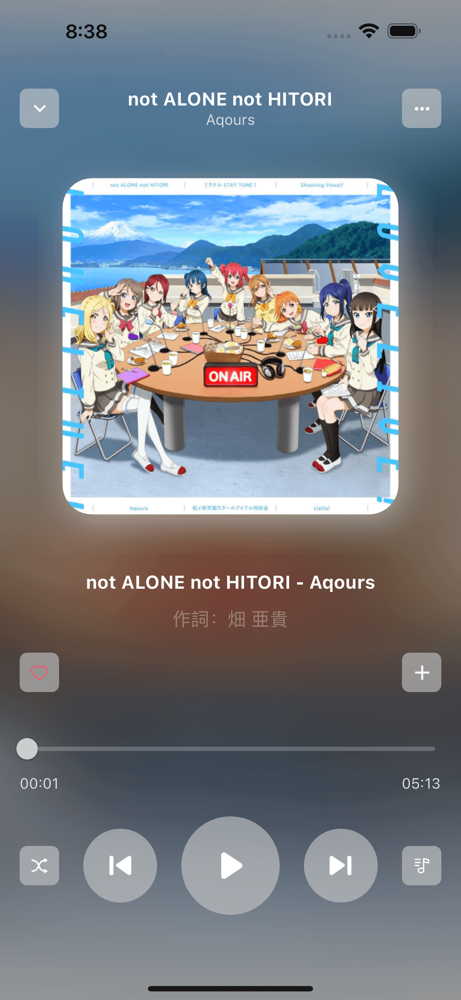

    

<h1 align="center">LLMP-M</h1>
<h3 align="center">一款送给 LLer 的专属移动播放器</h3>  
<h4 align="center">持续更新中....欢迎点波star</h4>
<h4 align="center">

Language: 中文 | [English Document](README_EN.md)

</h4>

你是否受够了[扣扣音乐]和[网抑云音乐]的版权忽有忽无，是否觉得国内播放器对舶来音乐不够重视，导致分类乱而难找。本项目旨在对 LoveLive 的全部歌曲做汇总整理，生成一份专属于 LLer 的播放器。

本程序非在线联网模式使用，只要下载资源便可离线运行，并且项目由 Flutter 开发，支持 IOS、Android部署。

1. 本项目遵守MIT + Apache 2.0协议，如需转载请标明作者ID(朱神无敌)
2. **请勿滥用，本项目仅用于学习和测试！请勿滥用，本项目仅用于学习和测试！请勿滥用，本项目仅用于学习和测试！**
3. 由于本项目的特殊性，可能随时停止开发或删档
4. 本项目为开源项目，不接受任何的催单和索取行为
5. 本人技术能力有限，职业是Android开发工程师，本项目旨在学习Flutter开发

本项目推荐配合LoveLiveMusicPlayer使用以达到最优体验，当然也同样支持仅移动端使用

功能列举：

- [AI开屏美图] √
- [播放器组件] √
- [专辑、歌曲数据库建立] √
- [企划选择] √
- [整张专辑播放与切换] √
- [自定义歌单] √
- [我喜欢] √
- [在线中文、日文、罗马音歌词] √
- [播放数据上报] √
- [歌曲快传 + 数据同步] √
- [亮色模式 + 暗黑模式 + 炫彩模式] √

**--Project_by [朱神无敌](https://space.bilibili.com/4367965)**

# 软件截图

# 关联PC软件
Github:<https://github.com/zhushenwudi/LoveLiveMusicPlayer>

Gitee:<https://gitee.com/zhushenwudi/love-live-music-player>

# 使用教程
哔哩哔哩：
软件介绍、教程：<https://www.bilibili.com/video/BV1cW4y177eX>

IOS软件介绍、教程：<https://www.bilibili.com/video/BV1R3411Z7Zs>

IOS AppStore:<https://apps.apple.com/cn/app/lovelivemusicplayer/id1641625393>

歌曲传输方式:

1. WiFi传输（PC和手机处于同一局域网）
2. USB传输

	Android：将LoveLive文件夹放入/Android/data/com.zhushenwudi.lovelivemusicplayer/files/
	
	IOS：将LoveLive文件夹放入 文件APP/LLMP/

	IOS由于版权审核原因，程序安装后不允许显示日文歌词和罗马音，需要在文件APP/LLMP/中创建名为LLMP的文件夹，重启应用后即可解锁完整功能

# 交流

QQ粉丝交流群：[724934644](https://jq.qq.com/?_wv=1027&k=FZkFfkP5)

B站空间：<https://space.bilibili.com/4367965>

# 发电

欢迎来py，大家的支持就是我继续开发的动力！

~~请可爱的wudi喝杯奶茶~~

## 项目内测

## 特别鸣谢

- 依然洳雪：<https://space.bilibili.com/13184888>

- 虹之咲字幕组：<https://space.bilibili.com/238547115>

- No.10字幕组：<https://space.bilibili.com/565597249>

- 其他个人翻译作者

- 播放器界面组件 [we_slide](https://github.com/luciano-work/we_slide)
- 歌词组件 [flutter_lyric](https://github.com/ozyl/flutter_lyric)

## 鸣谢

- 播放器组件 [just_audio](https://github.com/ryanheise/just_audio)
- 屏幕适配方案 [flutter_screenutil](https://github.com/OpenFlutter/flutter_screenutil)
- 数据库 [floor](https://github.com/pinchbv/floor)
- 萌娘百科 <https://zh.moegirl.org.cn>
- LLWiki <https://llwiki.org>

## 支持语言

- 英文 √
- 中文 √
- 德文 √
- 日文 x
- 法文 x
- 俄文 x
- 意大利文 x

## 开发

- 从dev分支拉取代码
	git clone https://github.com/zhushenwudi/LoveLiveMusicPlayerMobile.git

- 安装Android Studio插件
    GetX 和 FlutterAssetsGenerator
	
- 删除第三方库全部缓存 (可选、谨慎选择)
    flutter pub cache clean

- 拉取项目第三方依赖库
    flutter pub get
	
- 生成数据库 helper 文件
    flutter packages pub run build_runner build

## 许可证

[Apache-2.0](https://raw.githubusercontent.com/zhushenwudi/LoveLiveMusicPlayerMobile/master/LICENSE)
