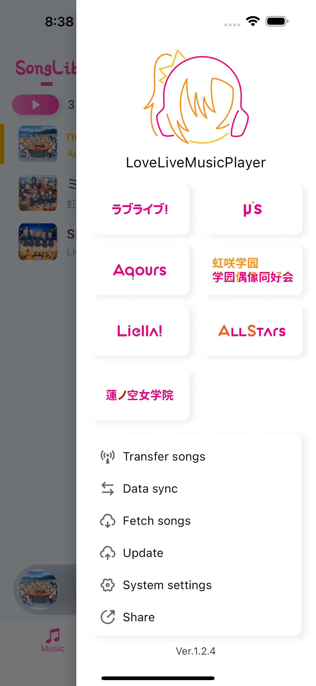
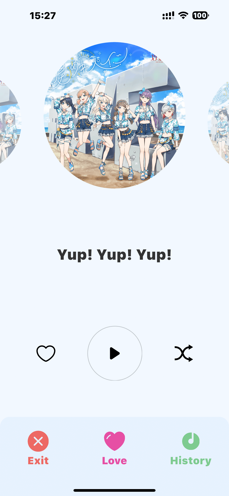
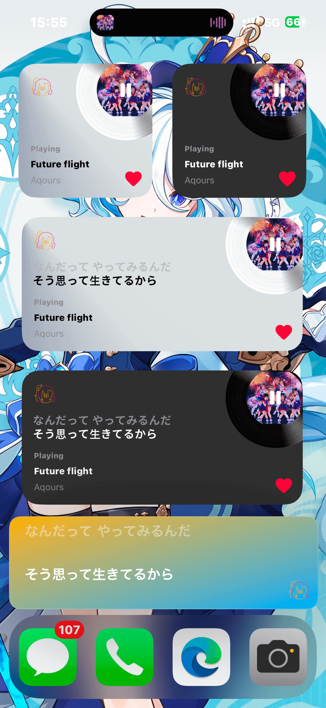

<p align="center">
    
</p>
<h1 align="center">LLMP-M</h1>
<h3 align="center">A dedicated mobile player for LLer</h3>
<h4 align="center">Continuously updating.... Welcome to Popstar</h4>
<h4 align="center">

Language: English | [中文](README.md)


</h4>

This project aims to summarize all the songs of LoveLive and generate a player dedicated for LLer.

This program is not used in online networking mode. It can be run offline as long as resources are downloaded. The project is developed by Flutter and supports IOS and Android deployment.

1. This project complies with the MIT and Apache 2.0 agreement. If it needs to be reproduced, please indicate the author ID (zhushenwudi).
2. **Please do not abuse it. This project is only for learning and testing! Please do not abuse, this project is only for learning and testing! Please do not abuse, this project is only for learning and testing!**
3. Due to the particularity of this project, development may be stopped or files may be deleted at any time.
4. This project is an open source project and does not accept any reminders or requests.
5. I have limited technical ability and I am an Android development engineer. This project aims to learn Flutter development.

This project is recommended to be used with LoveLiveMusicPlayer to achieve the best experience. Of course, it also supports the use of mobile device only.

Function list:

- [AI beautiful picture] ✓
- [Player component] ✓
- [Creation of album and song database] ✓
- [Planning selection] ✓
- [Play and switch of the whole album] ✓
- [Customized song list] ✓
- [I like it] ✓
- [Online Chinese, Japanese and Roman lyrics] ✓
- [Reporting of playing data] x
- [Fast transmission of songs and data synchronization] ✓
- [Bright color mode, dark color mode and dazzling color mode] ✓
- [Sleep mode stops at regular intervals] ✓
- [Dynamic stand image] ✓
- [DIY background image] ✓
- [Search in MoeGirl] ✓
- [Drive mode] ✓
- [Carplay support] ✓

**--Project_by [zhushenwudi](https://space.bilibili.com/4367965)**

# Screenshot







# Associated PC software
Github:<https://github.com/zhushenwudi/LoveLiveMusicPlayer>

Gitee:<https://gitee.com/zhushenwudi/love-live-music-player>

# Using guide
Bilibili:
Software introduction and guide:<https://www.bilibili.com/video/BV1cW4y177eX>

IOS software introduction and guide:<https://www.bilibili.com/video/BV1R3411Z7Zs>

IOS AppStore:<https://apps.apple.com/cn/app/lovelivemusicplayer/id1641625393>

Song transmission mode:

1. WiFi transmission (PC and mobile phone are in the same LAN)
2. USB transmission

	Android: Place the LoveLive folder in /Android/data/com.zhushenwudi.lovelivemusicplayer/files/
	
	IOS：Place the LoveLive folder in File.app /LLMP/
	
	Due to copyright review, IOS does not allow Japanese lyrics and Roman sounds to be displayed after the program is installed. You need to create a folder named LLMP in the file APPLLMP, and restart the application to unlock the full function
	
# Communication


QQ communication group：[724934644](https://jq.qq.com/?_wv=1027&k=FZkFfkP5)

Bilibili space:<https://space.bilibili.com/4367965>

# Give a reward

Welcome to gay me. Your support is my motivation to continue developing!

~~Invite the lovely wudi to have a cup of milk tea~~


## Project inner testing

## Special Thanks

- UI Design：<https://space.bilibili.com/202660950>

- Logo and Icon Design：<https://space.bilibili.com/85421205>

- 依然洳雪：<https://space.bilibili.com/13184888>

- 虹之咲 translators：<https://space.bilibili.com/238547115>

- No.10 translators：<https://space.bilibili.com/565597249>

- Other individual translators

- Player UI component [we_slide](https://github.com/luciano-work/we_slide)
- Lyric component [flutter_lyric](https://github.com/ozyl/flutter_lyric)

- Thanks to [JetBrains](https://www.jetbrains.com/?from=lovelivemusicplayermobile)
for allocating free open-source licences for IDEs such as
[IntelliJ IDEA](https://www.jetbrains.com/idea/?from=lovelivemusicplayermobile)
[](https://www.jetbrains.com/?from=lovelivemusicplayermobile)

## Thanks

- Player component [just_audio](https://github.com/ryanheise/just_audio)
- Fit screen programme [flutter_screenutil](https://github.com/OpenFlutter/flutter_screenutil)
- Database support [floor](https://github.com/pinchbv/floor)
- 萌娘百科 <https://zh.moegirl.org.cn>
- LLWiki <https://llwiki.org>

## Support languague

- English ✓
- Chinese ✓
- German ✓
- Japanese x
- French x
- Russian x
- Italian x

## Develop

- Pull code from dev branch
	git clone https://github.com/zhushenwudi/LoveLiveMusicPlayerMobile.git

- To install the Android Studio plug-in
	GetX and FlutterAssetsGenerator

- Delete all caches of third-party libraries (optional and cautious)
    flutter pub cache clean

- Pull the third-party dependency library of the project
	flutter pub get

- Generate database helper file
	dart run build_runner build

- Android Packaging(Disable Gradle Parallel)
  gradlew assembleRelease

- IOS Packaging
  #
  # Copy and replace the contents of sharesdk_plugin below to the following path through XCode
  # Pods/Development Pods/sharesdk_plugin/Pod/sharesdk_plugin.podspec
  #
    ```swift
      Pod::Spec.new do |s|
        s.name             = 'sharesdk_plugin'
        s.version          = '1.1.7'
        s.summary          = 'Flutter plugin for ShareSDK.'
        s.description      = <<-DESC
        ShareSDK is the most comprehensive Social SDK in the world,which share easily with 40+ platforms.
        DESC
        s.homepage         = 'http://www.mob.com/mobService/sharesdk'
        s.license          = { :file => '../LICENSE' }
        s.author           = { 'Mob' => 'www.mob.com' }
        s.source           = { :path => '.' }
        s.source_files = 'Classes/**/*'
        s.public_header_files = 'Classes/**/*.h'
        s.dependency 'Flutter'
        s.dependency 'mob_sharesdk'
        s.dependency 'mob_sharesdk/ShareSDKExtension'
        s.dependency 'mob_sharesdk/ShareSDKUI'
        s.dependency 'mob_sharesdk/ShareSDKPlatforms/QQ'
        
        s.static_framework = true
        
        s.ios.deployment_target = '12.0'
        end
    ```

  if an #import <MOBFoundation/MOBFDataModel.h> error is reported, you can comment it out.

## License

[Apache-2.0](https://raw.githubusercontent.com/zhushenwudi/LoveLiveMusicPlayerMobile/master/LICENSE)